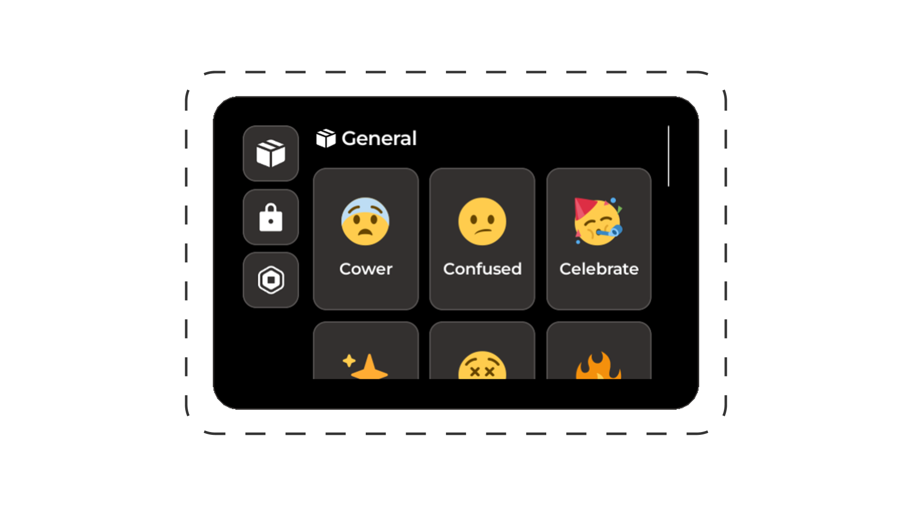

# Emotes



## Adding emotes

### Easy loader

Emotes are added as `Animation` instances within the Emotes folder:

```
[Explorer panel]
└── Rorooms/
    └── EasyLoader/
        └── Config/
            └── Emotes/
                └── <-- Your items here

[Properties panel]
└── Attributes/
    └── <-- Your properties here
```

### Manual config

```lua
Rorooms:Configure({
  Systems = {
    Emotes = {
      Emotes = {
        MyEmote = {
          -- Properties here
        }
      }
    }
  }
})
```

### Properties

| Attribute             | Type        | Required                  |
| --------------------- | ----------- | ------------------------- |
| `EmoteId`             | `string`    | ⚠️ - Only w/ easy loader   |
| `Animation`           | `Animation` | ✅ - Only w/ manual config |
| `Emoji`               | `string`    | ❌                         |
| `AllowMovement`       | `boolean`   | ❌                         |
| `DisplayName`         | `string`    | ❌                         |
| `LevelRequirement`    | `number`    | ❌                         |
| `GamepassRequirement` | `number`    | ❌                         |
| `Category`            | `string`    | ❌                         |
| `Color`               | `Color3`    | ❌                         |
| `LabelText`           | `string`    | ❌                         |
| `LabelIcon`           | `string`    | ❌                         |