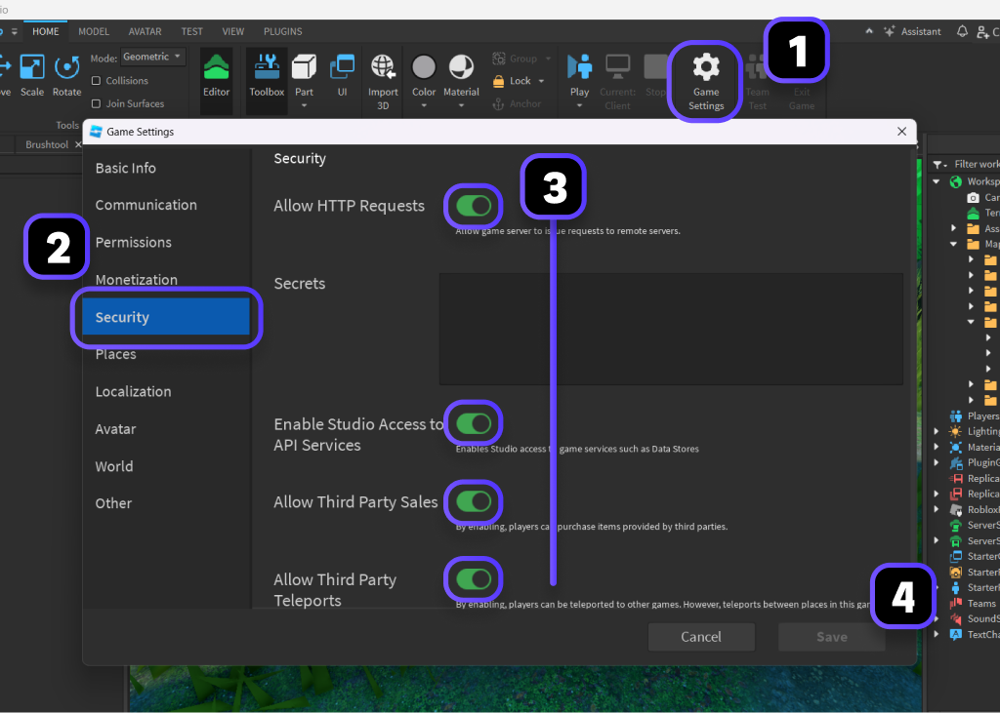

# Getting Started

## Installation

### Roblox

1. Get the [Rorooms](https://create.roblox.com/store/asset/131892669922226) model
2. Insert it from the Toolbox
3. Place into `ReplicatedStorage`

### Wally

1. Copy the [Wally package](https://wally.run/package/rorooms/rorooms) details
2. Paste it into your `wally.toml` dependencies
3. Run `wally install`

## Game settings

For Rorooms to properly function, you need to enable a few Security settings within your Game Settings. This allows Rorooms to access the APIs its features rely on.

