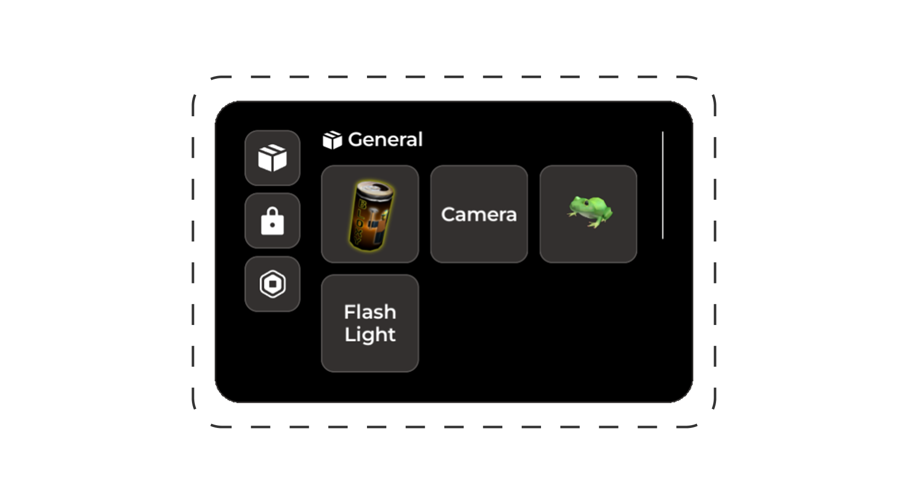

# Items

An integrated items system supporting categorization, level-locking, and monetization.



## Adding items

### Easy loader

Items are added as `Tool` instances within the Items folder:

```
[Explorer panel]
└── Rorooms/
    └── EasyLoader/
        └── Config/
            └── Items/
                └── <-- Your items here

[Properties panel]
└── Attributes/
    └── <-- Your properties here
```

### Manual config

```lua
Rorooms:Configure({
  Systems = {
    Items = {
      Items = {
        MyItem = {
          -- Properties here
        }
      }
    }
  }
})
```

### Properties

| Property              | Type     | Required                  |
| --------------------- | -------- | ------------------------- |
| `ItemId`              | `string` | ⚠️ - Only w/ easy loader   |
| `Tool`                | `Tool`   | ⚠️ - Only w/ manual config |
| `DisplayName`         | `string` | ❌                         |
| `LevelRequirement`    | `number` | ❌                         |
| `GamepassRequirement` | `number` | ❌                         |
| `Category`            | `string` | ❌                         |
| `Color`               | `Color3` | ❌                         |
| `LabelText`           | `string` | ❌                         |
| `LabelIcon`           | `string` | ❌                         |