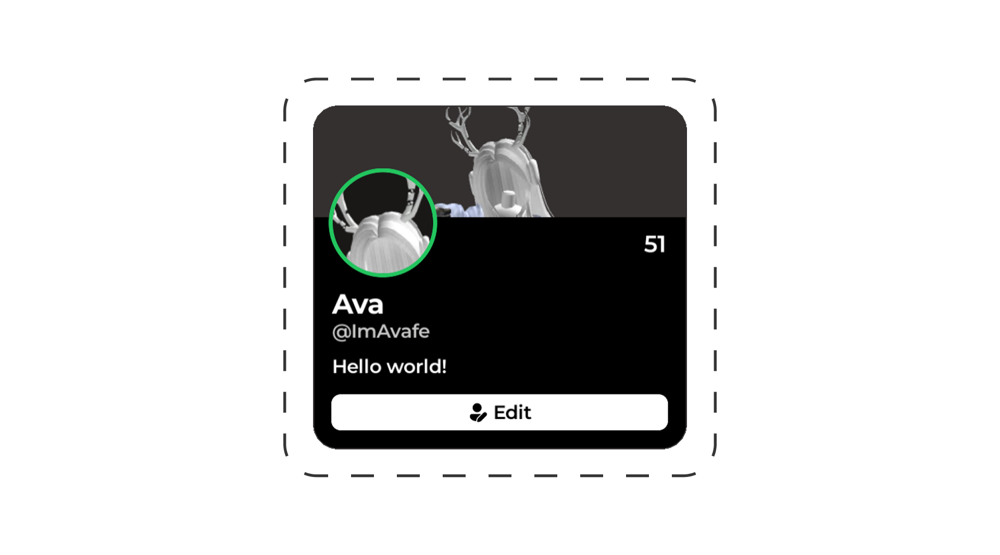

# Profiles

A full profiles system supporting nicknames, bios, roles, and leveling! Edit your own profile, or click on players in-game to view theirs.



## Adding roles

### Easy loader

```
[Explorer panel]
└── Rorooms/
    └── EasyLoader/
        └── Config/
            └── Roles/
                └── <-- Your roles here

[Properties panel]
└── Attributes/
    └── <-- Your properties here
```

### Manual config

```lua
Rorooms:Configure({
  Systems = {
    Profiles = {
      Roles = {
        MyRole = {
          -- Properties here
        }
      }
    }
  }
})
```

### Properties

| Attribute             | Type     | Optional              |
| --------------------- | -------- | --------------------- |
| `RoleId`              | `string` | ⚠️ - For manual config |
| `Name`                | `string` | ❌                     |
| `Color`               | `Color3` | ✅                     |
| `LayoutOrder`         | `number` | ✅                     |
| `LevelRequirement`    | `number` | ✅                     |
| `GamepassRequirement` | `number` | ✅                     |
