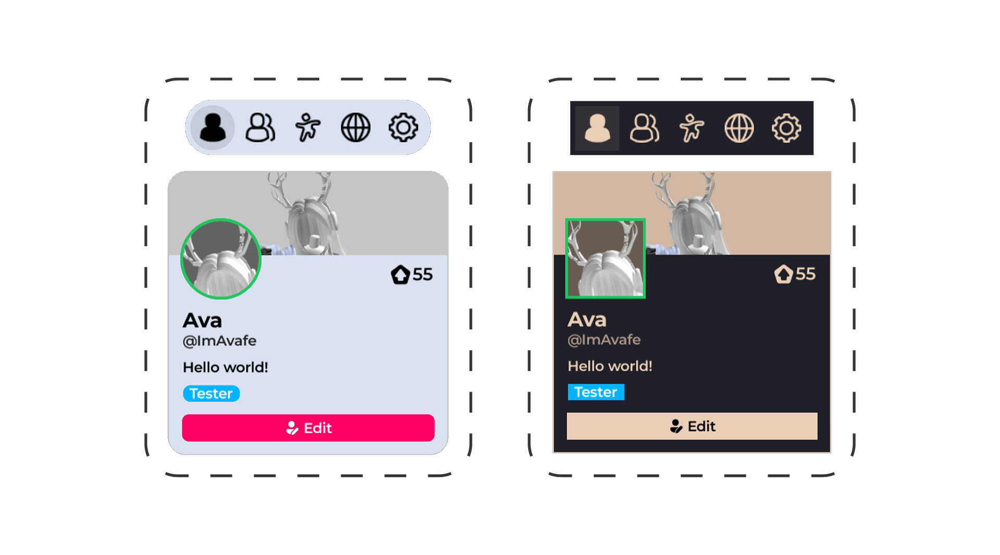

# Theming

Rorooms supports a variety of UI theming properties, empowering you to match your world's unique mood and style.



## Setting a custom theme

```lua
Rorooms:Configure({
  Systems = {
    UI = {
      OnyxUITheme = {
        -- Colors = {
        --   Primary = {
        --     Main = Color3.fromRGB(255, 255, 255),
        --   },

        --   Base = {
        --     Main = Color3.fromRGB(0, 0, 0),
        --   },
        --   BaseContent = {
        --     Main = Color3.fromRGB(255, 255, 255),
        --   },

        --   Neutral = {
        --     Main = Color3.fromRGB(51, 47, 46),
        --   },
        --   NeutralContent = {
        --     Main = Color3.fromRGB(196, 196, 195),
        --   },
        -- },
        -- Font = {
        --   Body = "rbxasset://fonts/families/Montserrat.json",
        --   Heading = "rbxasset://fonts/families/Montserrat.json",
        --   Monospace = "rbxasset://fonts/families/Montserrat.json",
        -- },
        -- FontWeight = {
        --   Body = Enum.FontWeight.SemiBold,
        --   Bold = Enum.FontWeight.Bold,
        --   Heading = Enum.FontWeight.Bold,
        -- },
        -- TextSize = {
        --   Base = 17,
        -- },
        -- CornerRadius = {
        --   Base = 6,
        -- },
        -- StrokeThickness = {
        --   Base = 1,
        -- },
        -- SpringSpeed = {
        --   Base = 60,
        -- },
        -- SpringDampening = {
        --   Base = 1.25,
        -- },
      }
    }
  }
})
```

See the full list of theme properties [here](https://github.com/loneka/onyx-ui/blob/main/src/Themer/ThemeSpec.luau).