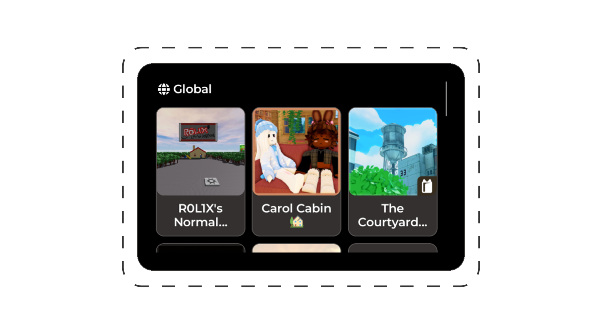
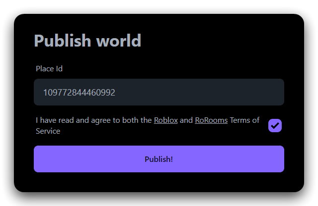
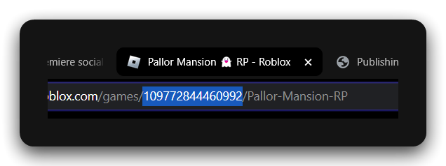
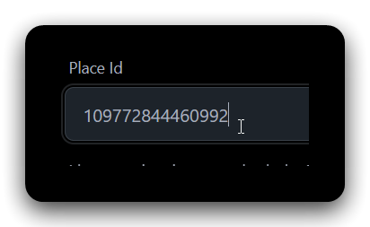
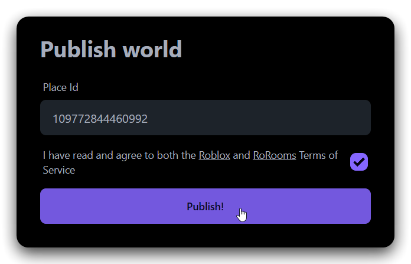

# Worlds

Rorooms provides its own network of worlds, secured via peer-to-peer ranking based on received teleports. At scale, this creates a network effect where worlds promote each other, and the network is uplifted as a whole.



## Publishing

1. Visit [rorooms.com/publish](https://rorooms.com/publish)



1. Copy your world's PlaceId



3. Paste it in



1. Publish! 🎉



## Featuring your own worlds

List your own worlds right at the top of the menu with a few lines:

```lua
Rorooms:Configure({
  Systems = {
    Worlds = {
      FeaturedWorlds = {
        -- Your PlaceIds here
      }
    }
  }
})
```

## Disabling discovery

You may not want to participate in Rorooms' worlds network, and that choice is supported. Understand that by doing this, your world will not receive support from any other worlds.

```lua
Rorooms:Configure({
  Systems = {
    Worlds = {
      DiscoveryEnabled = false,
      Enabled = false, -- If you don't want to feature your own worlds
    }
  }
})
```